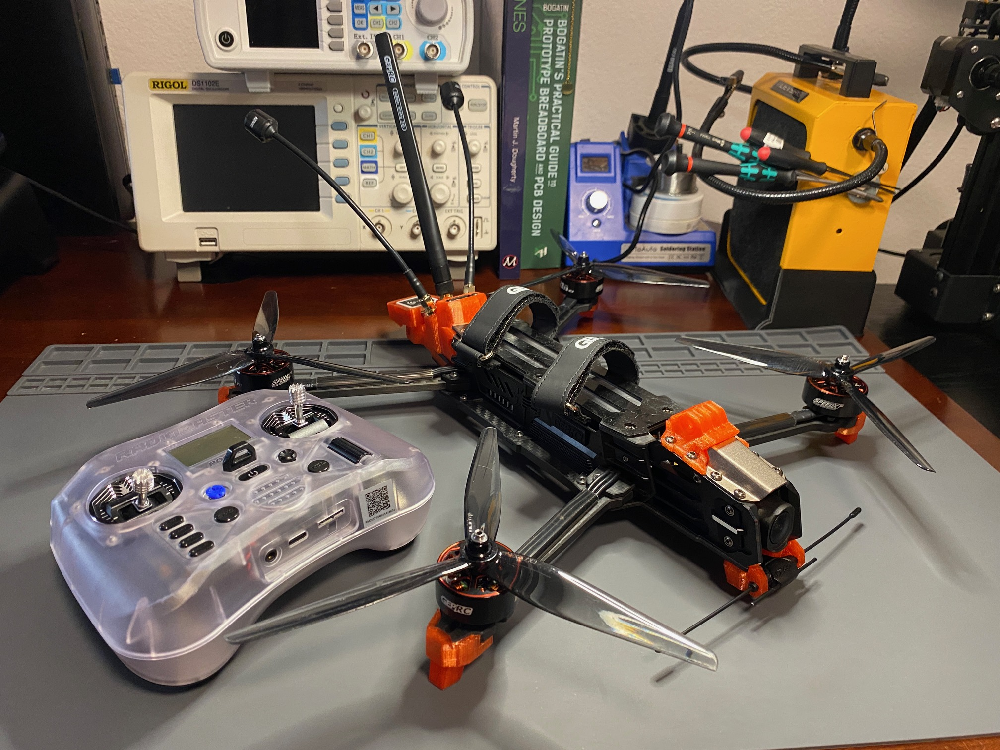
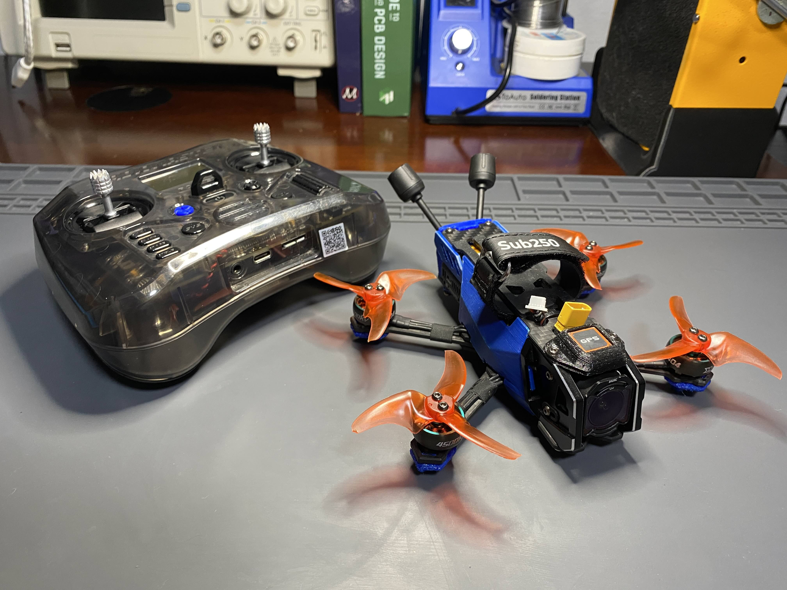
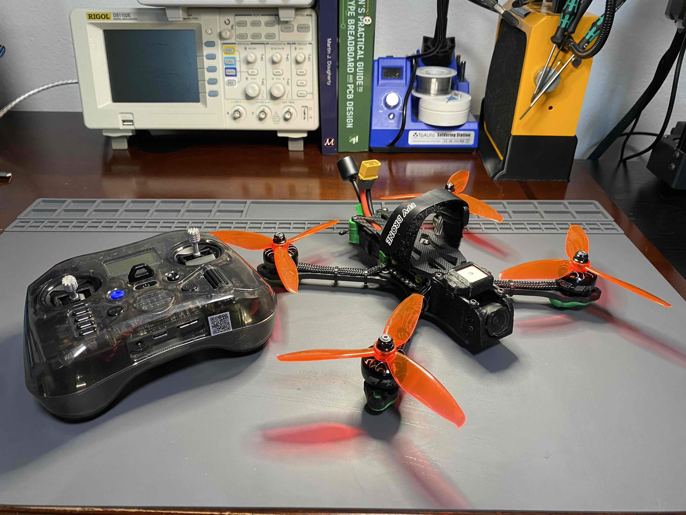
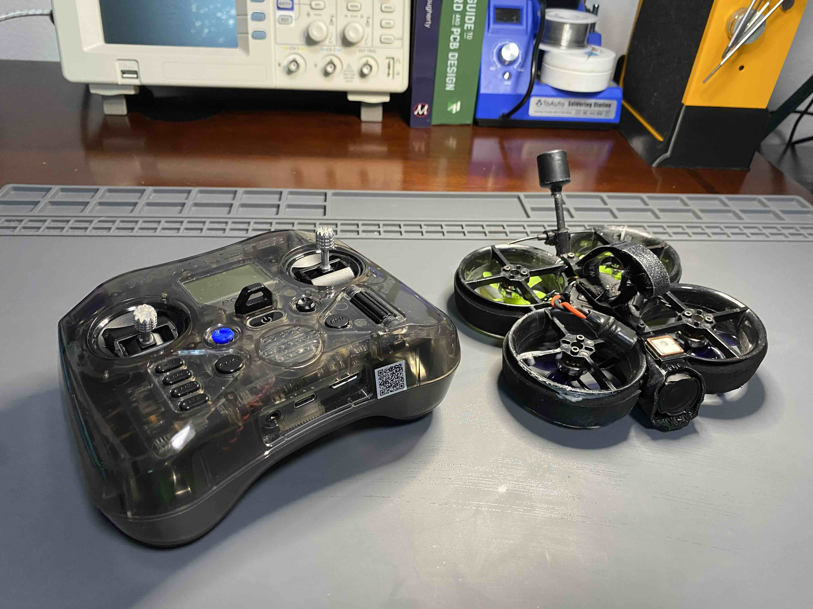
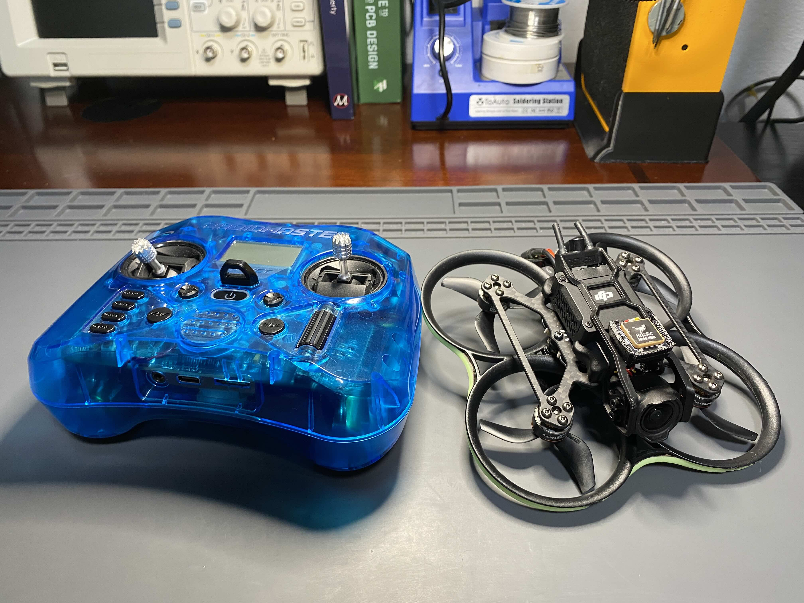

# betaflight-quads
betaflight settings for quads.

---

**GEPRC Moz7 V2**

- O4 Pro.
- H743 flight controller.
- GEP-M1025 GPS.
- ELRS 915M/2.4G Gemx dual-band receiver.
- VIFLY Finder V2 Buzzer.

---

**Sub250 OasisFly25**

- O4 Pro + ELRS Bind and fly.
- M10 SUB250 GPS. 
- Added 220uF low ESR capacitor.
- Ziptied battery input cable.
- VIFLY Finder V2 Buzzer with battery seperated.
- 3D printed custom GPS tail mount.

---
**Rekon 5 Mini Long Range**
https://shop.addictiverc.com/products/rekon-5-mini-long-range-quad-digital-version-6s-tbs?srsltid=AfmBOoqY8LGfrmh7izpQQuCefXy7zYFx47J0tmg7TPUGeJpi2J_WOFRn

---

**GM5**

- Speedybee F405V3 F55A.
- Emix 5 inch S4.
- XING 2207 1800KV.
- DJI O3 Air.
- RP1 ELRS Nano.
- OVONIC 4s 100C 1550mAh.
- HGLRC LED Mini (38mm).
- VIFLY Finder V2 Buzzer.
- SEQURE M10-18 GPS.
- FPV Drone 220mm Frame 5 inch Carbon Fiber.

---

**Flywoo Cinerace20**

- Bind and fly.

---

**BetaFPV Pav20 Pro**

- [Bind and fly](https://betafpv.com/products/f4-2-3s-20a-aio-fc-v1)
- HGLRC M100 GPS mini

---

# radio transmitters
Settings for transmitters.

**Radiomaster Pocket**
- Cinerace20 9/29/24
- Conscendo 9/29/24
- QUAD MODE 1/15/26
- Liftoff 1/19/25
- ZOHD ALTUS 1/15/26

**IRX4**
- Spectrum DSM